# 和云教育

### 类型
> ***教育类小程序***

### 描述
本项目参考于广东和教育，自制的教育管理平台，它实现了教师端和家长端，对不同角色进行管理，通过登录角色不同展示不同端的页面。在教师端可以布置作业，发布通知，浏览咨询，接收消息通知，切换登录等待功能；家长端可以接收通知，在线完成作业，查看咨询，申请加入班级等待功能。

### 部署
下载小程序开发者功能，导入本项目即可。

### 项目截图
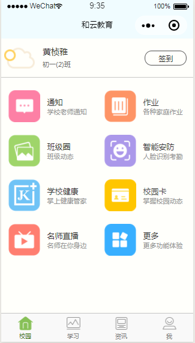
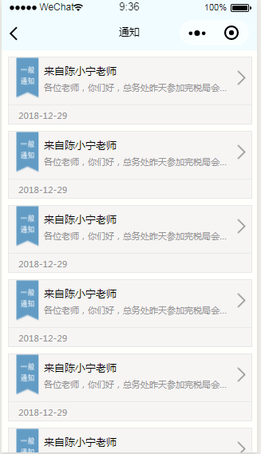
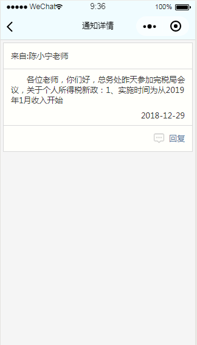

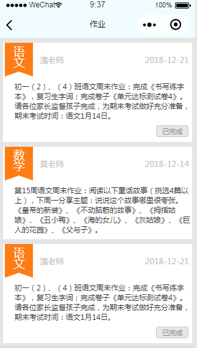
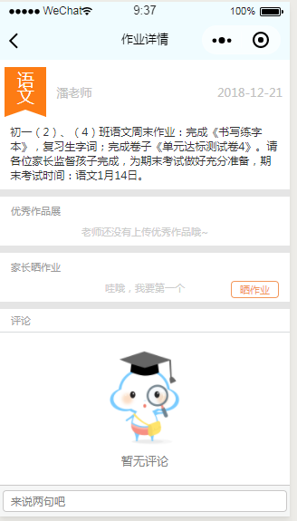
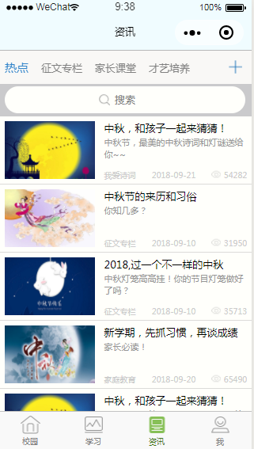
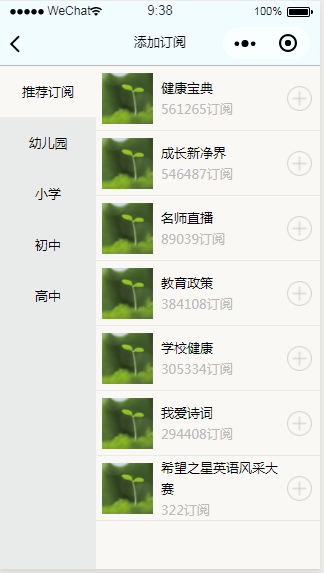
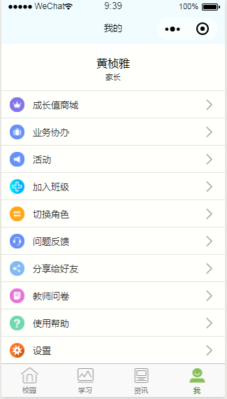
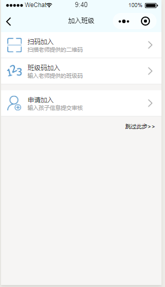
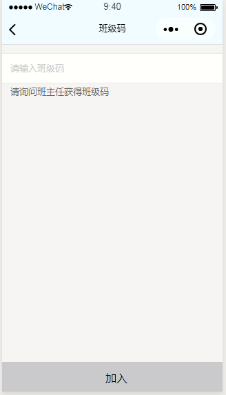
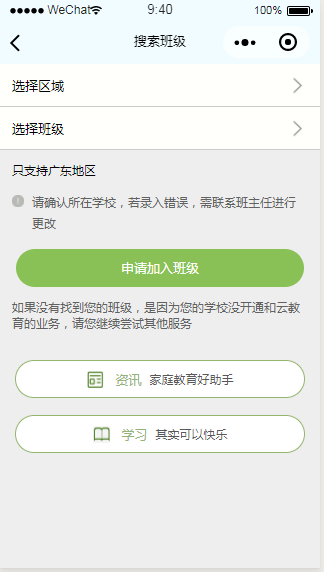
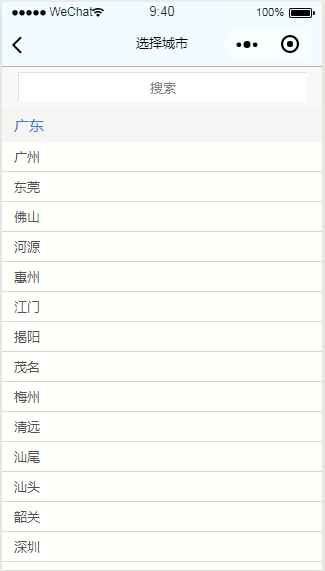
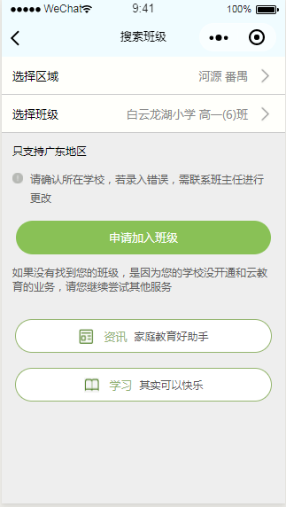

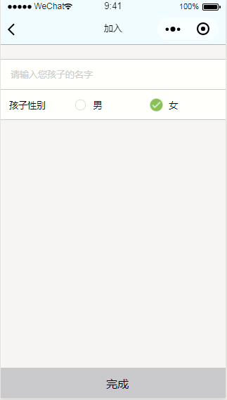
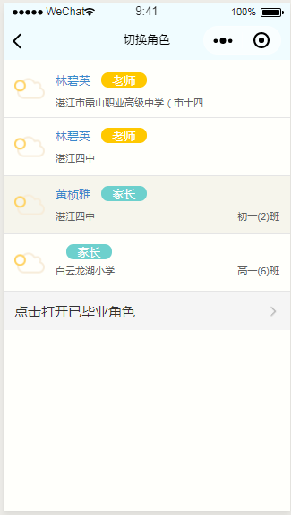
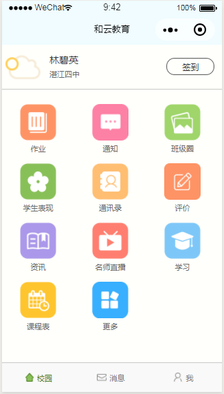
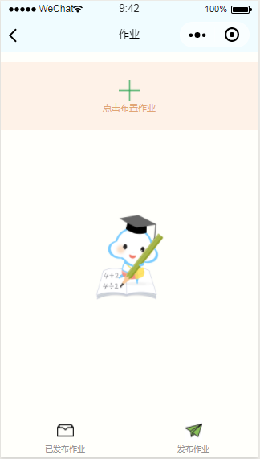
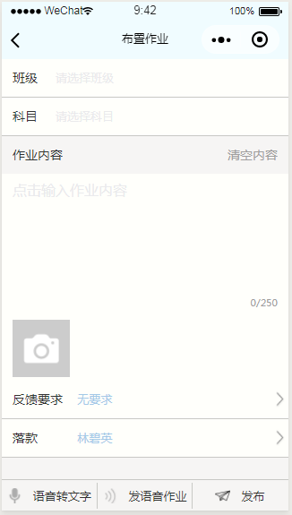
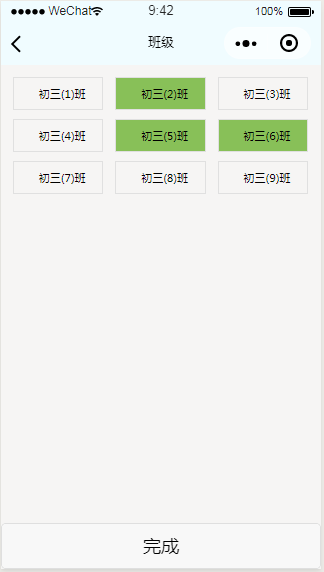
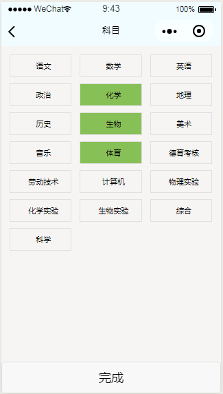
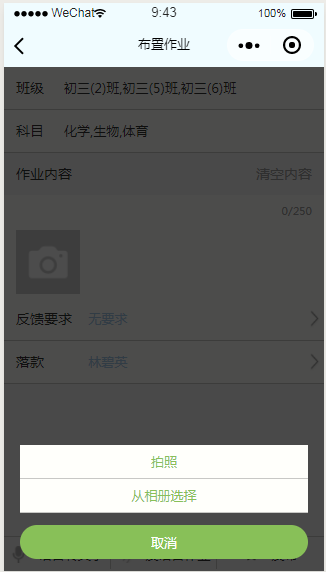
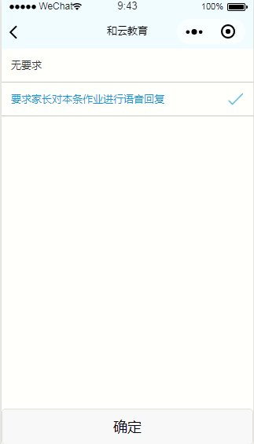
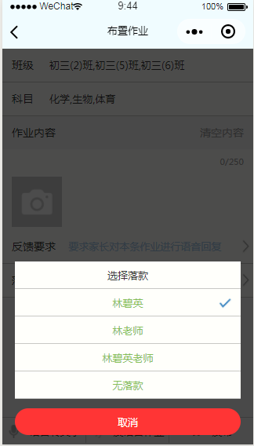
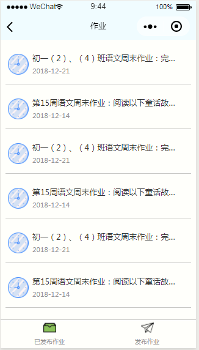
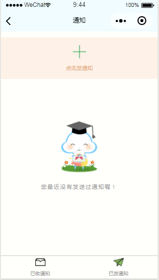
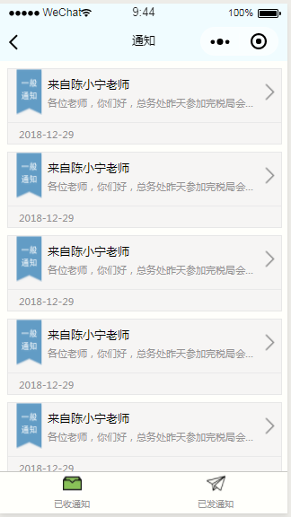
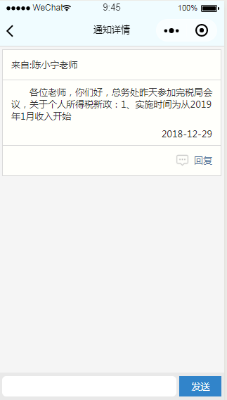
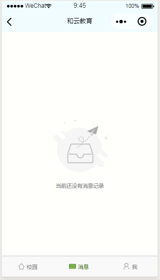
![](./docs/程序设置.png）
